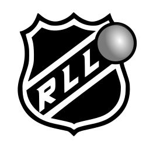

#  RLL PWA

### Goal  
Make a simplified version of the website that is mobile friendly
### Setup
- Install dependencies   
  - `npm install`
### Usage
- Run in dev mode
  - `npm run dev`
- Build for production
  - `npm run build`
- Run last production build
  - `npm start`
### Deployment
- Deploy update to production
  - push new commit to `main`

### Description
Shows a simple schedule of games for the current season. Clicking a team name filters the schedule to that team.
- Next.js
  - for build-time data fetching (data is relatively static so we just re-deploy when updates are needed)
- React
  - Material-UI
- Data fetching from Fauna DB
